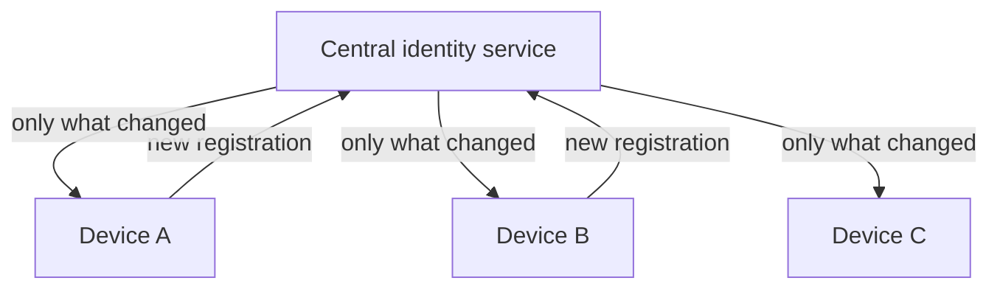

# Face Recognition Project — Phase Plan

Sep 25, 2026 · @Sujay

## Overview

The project builds an Android app that identifies a person from their face **entirely on the device** and links them to a health identifier (ABHA). It is developed as nine phases, each answering one question, because most design questions here are settled by measurement rather than assumption.

```
BUILD -> TEST -> MEASURE -> DOCUMENT -> LEARN -> IMPROVE
```

One constraint runs through every phase. This is **1:N open-set identification** ("who is this, if anyone?"), not 1:1 verification ("is this who they claim to be?"). Given a gallery, the system will always find some nearest face, so it must be able to answer **I don't know**. The architecture is built around preventing false matches, not around maximising a headline accuracy number.

| Phase | Question it answers | Status |
| --- | --- | --- |
| 1 | Can we make it work on a device? | In progress |
| 2 | How reliable is it? | Planned |
| 3 | Can we prevent wrong matches? | Planned |
| 4 | Can it handle a large gallery? | Planned |
| 5 | Which model belongs on the phone? | Planned |
| 6 | Does it work on the people it is for? | Planned |
| 7 | Can many devices stay in sync? | Planned |
| 8 | Can it be made secure and spoof-resistant? | Planned |
| 9 | Does the whole architecture hold up? | Planned |

Nothing beyond Phase 1 is committed work. Each later phase must be justified by what the previous one measured.

## Phase 1 — On-device prototype (current)

**Question: can we make it work?** Not an accuracy evaluation. A person is registered with several face images, identified later from the camera alone, and given a placeholder ABHA ID, with the system free to answer MATCH, UNCERTAIN or UNKNOWN.

| Milestone | Scope | Status |
| --- | --- | --- |
| M0 | Toolchain, git, emulator | Done |
| M1 | App builds, models load on device | Done |
| M2 | Detect, align, embed, search, decide | Done |
| M3 | Database, registration, duplicate warning | Done |
| M4 | Quality checks, configurable thresholds | Done |
| M6 | Demo UI with live camera | Done |
| M5 | ~100-person gallery, search at scale | Remaining |

M6 was brought forward ahead of M5 to have a demo ready.

**What is built:** ML Kit finds the face; a 5-point transform straightens it; MobileFaceNet turns it into 512 numbers; the app compares those against stored faces and applies a three-way decision. Seven quality gates reject unusable input before it ever reaches the model. Everything runs on the device, and 91 automated tests pass.

**Measured so far**, on 10 people and 70 public research photos: the correct person ranked first 10 out of 10 times, and none of 10 never-registered people was wrongly matched. On the emulator the pipeline takes about 94 ms on small images.

**Deliberately not claimed.** Ten people cannot establish an error rate. The thresholds are starting points, not calibrated settings. The emulator timings say nothing about a real phone. A live MATCH against a real face has not yet been demonstrated.

**Known blockers:** no physical phone yet, and the model weights are licensed for non-commercial research only, which is fine for a prototype but blocks any deployment.

## Phase 2 - How reliable is it?

**Question: how many registration images, and how does it behave in real conditions?** Phase 1 uses 5 images per person because a number had to be chosen, not because 5 was shown to be right.

The count is already configurable, so this phase is mostly measurement rather than new code.

| Experiment | What it compares |
| --- | --- |
| Image count | 3 vs 5 vs 7 vs 10 images per person |
| Spectacles | Registered with glasses, identified without, and the reverse |
| Lighting | Normal, dim, harsh and uneven light |
| Pose | How far the head can turn before recognition degrades |
| Distance | How far from the camera still works |
| Expression | Neutral versus natural expressions |

The output is evidence for the registration flow: how many images to ask for, and which variations are worth prompting the operator to capture. Expect a trade-off, since more images means better coverage but slower, more tiring registration.

## Phase 3 - Can we prevent wrong matches?

**Question: where should the thresholds sit?** This phase most determines whether the system is safe to use. In healthcare, a confident wrong identification is far worse than a refusal to identify.

The three-way decision already exists. What is missing is evidence for the numbers behind it: the minimum similarity to accept, the gap required over the next-best **different** person, the input-quality floor, and whether several captures should have to agree.

| Metric | Plain meaning |
| --- | --- |
| False accept | How often someone is identified as the wrong person |
| False reject | How often a registered person is not recognised |
| Unknown detection | How often a stranger is correctly refused |
| Score distributions | How far apart same-person and different-person scores sit |

The deliverable is a chosen operating point with its error rates stated, rather than a single accuracy figure. Phase 1 already produced a hint: the initial threshold of 0.5 would have rejected a genuine person scoring 0.441, so it was lowered to 0.35 on evidence.

A decision is also needed on what the system should do when it is unsure, since retrying, asking for another capture, and falling back to a different identification method are all different operational answers.

## Phase 4 - Can it handle a large gallery?

**Question: what happens as the number of registered people grows?** Two separate things degrade, and they must be measured separately.

**Speed.** Phase 1 compares against every stored face. That is fine for hundreds and untenable for millions, so this phase measures where it stops being acceptable.

**Accuracy.** This is the less obvious and more serious effect. The more people in the gallery, the more chances that a stranger resembles someone in it. False matches get more likely as the system grows, so thresholds proven at 100 people cannot be assumed to hold at 100,000.

| Gallery size | What to record |
| --- | --- |
| 1,000 | Search time, memory, storage |
| 10,000 | Same, plus false-match rate |
| 100,000 | Same, plus whether exact search is still viable |
| 1,000,000 | Same, on real hardware |

If exact search becomes too slow, an approximate index (ANN) is introduced. That brings a second kind of failure: the index may simply fail to retrieve the right person, even when the model would have recognised them. Retrieval failures and recognition failures must then be measured apart, or the cause of an error becomes unknowable.

Storage is not the constraint people expect. At roughly 2 KB per person, a million people is about 2 GB, and compressing the stored numbers can cut that substantially.

## Phase 5 - Which model belongs on the phone?

**Question: is the small model good enough, or is the large one affordable?** Phase 1 uses MobileFaceNet (13.6 MB) because it is small. That choice has not been tested against the alternative.

The published figures from the model's own authors make the stakes clear:

| Model | Size | Common benchmark | South Asian faces |
| --- | --- | --- | --- |
| ResNet50 | 326 MB | 99.83 | 93.16 |
| MobileFaceNet (current) | 13.6 MB | 99.70 | 73.39 |

On the common benchmark the two look equivalent. On South Asian faces they are roughly 20 points apart. Since the intended users are Indian, this is arguably the single most important number in the project, and it is the reason this phase is not optional.

What to measure on real hardware, for both models: accuracy on the target population, speed, memory, model size, battery drain and heat.

The assumption worth testing is that the large model is too slow for a phone. The target allows 2 seconds per attempt, which may well be enough. Only measurement settles it.

A separate comparison belongs here too: the current face detector against the alternative already bundled in the project, since their landmark points differ slightly and that difference may affect accuracy.

## Phase 6 - Does it work on the people it is for?

**Question: how does the system perform on the actual target population?** Every number produced before this phase comes from LFW, a public research set of celebrity press photographs that is heavily skewed towards white male adults. It is adequate for proving the software works. It says nothing about how the system behaves on Indian users.

The gap is not hypothetical. The model's own published scores drop by about 20 points on South Asian faces compared with the benchmark everyone quotes.

This phase builds a properly consented evaluation set and measures performance across the variation that actually exists in the population: region, age, sex, skin tone, spectacles, facial hair, head coverings, lighting, camera quality and pose.

**Fine-tuning is a possible outcome, not a plan.** The model is only adjusted if the evaluation shows a specific weakness worth fixing. Fine-tuning without that evidence risks making things worse while appearing productive.

**This phase collects real biometric data from real people, which changes its nature entirely.** Under India's DPDP Act 2023 this is sensitive personal data requiring informed consent, a stated purpose, and rights to deletion. Stored face representations count as biometric data even though they are not photographs. Consent, retention and deletion must be designed before collection starts, because they constrain how the data may be gathered at all. This is a workstream in its own right, not a checkbox.

## Phase 7 - Can many devices stay in sync?

**Question: how does someone registered on one device get recognised on another?** Phase 1 is a single device with its own local database. The moment there are several registration points, they must share what they know.



The design constraints:

- send only what changed, never the whole database
- resume cleanly after an interrupted transfer
- keep identification working offline, since recognition must not depend on a network
- propagate removals and corrections, not just additions
- transfer face representations rather than photographs

**The hard problem is not transport, it is identity.** If two devices register the same person at the same time, the system must detect it centrally and resolve it, or one person quietly ends up with two records. That is the same duplicate-detection problem as Phase 1, but now across devices and without a human present to judge.

## Phase 8 - Can it be made secure and spoof-resistant?

**Question: can the system resist someone attacking it, rather than merely using it?** Phase 1 has no meaningful defences, which is acceptable for a prototype holding public research photos and placeholder IDs, and unacceptable for anything else.

**Liveness is the most urgent gap.** Today, holding a printed photograph or a phone screen in front of the camera would very likely be accepted as the person. Any real deployment needs presentation-attack detection, and it needs to be evaluated as its own problem, since attacks evolve.

The rest of the security workstream:

| Area | What it covers |
| --- | --- |
| Encryption | Face data protected on the device and in transit |
| Extraction resistance | Making the local database hard to lift off a stolen device |
| Authentication | Only authorised operators and devices can register or identify |
| Authorisation | Who may do what, enforced rather than assumed |
| Audit | A tamper-evident record of identity operations |
| Key management | Where keys live and how they rotate |
| Data lifecycle | Retention, correction, deletion and breach response |

**Real ABHA integration belongs here, not earlier.** It must go through the authorised ABDM workflow with the person's consent. The design deliberately keeps *recognising a face* separate from *linking to a health identity*, so consent and authorisation have somewhere to sit. A face match should never by itself be treated as authority over someone's health record.

## Phase 9 - Does the whole architecture hold up?

**Question: do the parts still work when combined under realistic conditions?** Every earlier phase tests one thing in isolation. This phase tests them together, because problems tend to appear at the joins.

What gets exercised at once: a large gallery, many devices registering at the same time, unreliable networks, real operators under time pressure, and the security and liveness layers running live rather than in a test.

What gets reported: false accepts and false rejects at the chosen operating point, how reliably strangers are refused, end-to-end speed on real hardware, whether devices actually converge on the same data, and how the system behaves when something fails.

The honest framing is that this phase is where optimistic assumptions surface. A system that performs well in nine separate experiments can still fail as a whole, and the point of running it is to find that out before deployment rather than after.

## How phases advance

A phase ends when its question has a measured answer, not when its code is written. Closing one means running the tests, recording the actual numbers, documenting what failed as well as what worked, and stating what is still unknown.

The next phase is then justified by that evidence. Phases 2 to 9 are candidates, not commitments: if Phase 2 shows recognition is unreliable in ordinary lighting, that matters more than scaling to a million people.

**Standing constraints, in every phase:**

- No accuracy claim without a stated measurement and test set.
- Never force the nearest candidate to be a match.
- Thresholds are configuration and stay uncalibrated until measured.
- Keep the model and detector replaceable.
- Document what actually happened, including failed approaches.
- Do not build a later phase's functionality early.

**Two facts that constrain the whole plan:**

The current model weights are licensed for **non-commercial research only**. They are fine for the prototype and every measurement phase, but no deployment can ship them. A replacement is needed before Phase 8 at the latest.

The moment real faces are collected, in Phase 6, the project moves from public research photographs to sensitive personal data. That is a legal and ethical threshold, not a technical one, and the consent and deletion design has to exist before collection begins rather than after.
